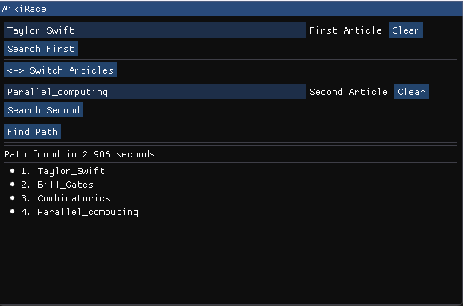

# WikiRace


A Graph based Wikipedia solver
Data from: https://dumps.wikimedia.org/enwiki/latest/  

## Reccomended specs
16gb of ram  
8 core cpu w/hyper threading  
NVME SSD  

## Setup
### Install
download the following files and run the following shell commands to setup database  
(SQLite is a required dependency)  
Note this will download ~10 gb, the database created will be 30gb  
```
wget https://dumps.wikimedia.org/enwiki/latest/enwiki-latest-page.sql.gz https://dumps.wikimedia.org/enwiki/latest/enwiki-latest-pagelinks.sql.gz https://dumps.wikimedia.org/enwiki/latest/enwiki-latest-redirect.sql.gz https://dumps.wikimedia.org/enwiki/latest/enwiki-latest-linktarget.sql.gz  
./parse.sh
./insert.sh  
```

A completed database can also be found here:  
```
https://drive.google.com/file/d/1ictDdg47LH-8rf1LApjV6BU3xMDISp0z/view?usp=sharing
```

### Compile
Compile the project with CMAKE
```
cd build  
cmake ..  
cmake --build . --config Release   
```

#### Compile SFML 
Tell Cmake where to find the packages (Changing C:/Path/To/ to where your vcpkg has it installed)  
```
cmake .. -G "Ninja" -DCMAKE_TOOLCHAIN_FILE=C:/Path/To/vcpkg/scripts/buildsystems/vcpkg.cmake -DVCPKG_TARGET_TRIPLET=x64-mingw-dynamic
```
(SFML DLL's will need to be in the root directory of the executable if dynamic).  

## Example output


